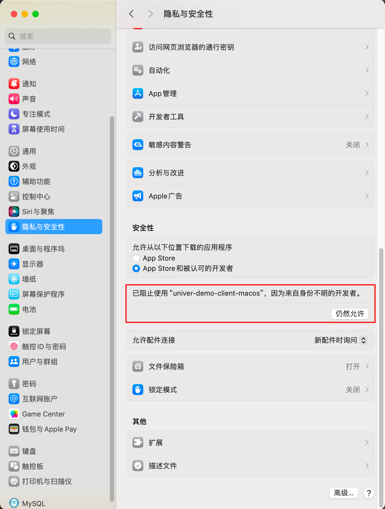

## Quick Start

### 1. Obtain Univer Service

Download the binary compressed package

``` url
https://release-univer.oss-cn-shenzhen.aliyuncs.com/release-demo/darwin.zip
```

Create a separate directory and extract all the contents of the compressed package to that directory

### 2. Start Univer Service

Execute the command

```bash
chmod +x ./start_apps.sh
```

```bash
./start_apps.sh
```

注：mac需要在设置与隐私中允许非 App store 应用运行，[详见](#如何允许非app-store应用访问)

### 3. Create and Access

Copy the URL link into the browser, locally experience the joy of Univer collaboration

```url
http://localhost:3010/
```


Note: Locally open different browsers or use incognito mode to experience collaboration!


### 4. Share

You can also copy the browser link and send it to friends in the same network to experience Univer collaboration together

Remember to replace localhost with the local IP url

```url
http://localhost:3010/?unit=17443300120626831361&type=2
//Example http://192.168.50.172:3010/?unit=17443300120626831361&type=2
```

## Remarks

### 如何允许非App store应用访问



### How to Find Local IP

Execute the command

``` bash
ifconfig |grep -w  'inet' |grep -v "127.0.0.1" | awk '{print $2}'
```


### How to stop the service

```bash
chmod +x ./stop_apps.sh
```

```bash
./stop_apps.sh
```

## Port Usage

| service       | port      | description          |
|---------------|-----------|----------------------|
| universer     | 8000，9000 | api http server      |
| univer-server | 5001，5002 | collaboration server |
| univer-client | 3010      | frontend             |
